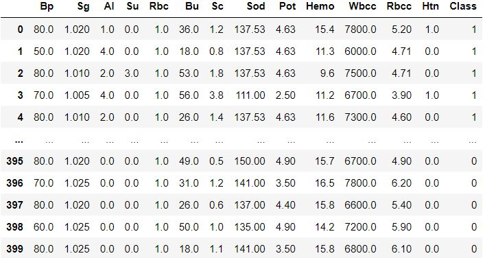
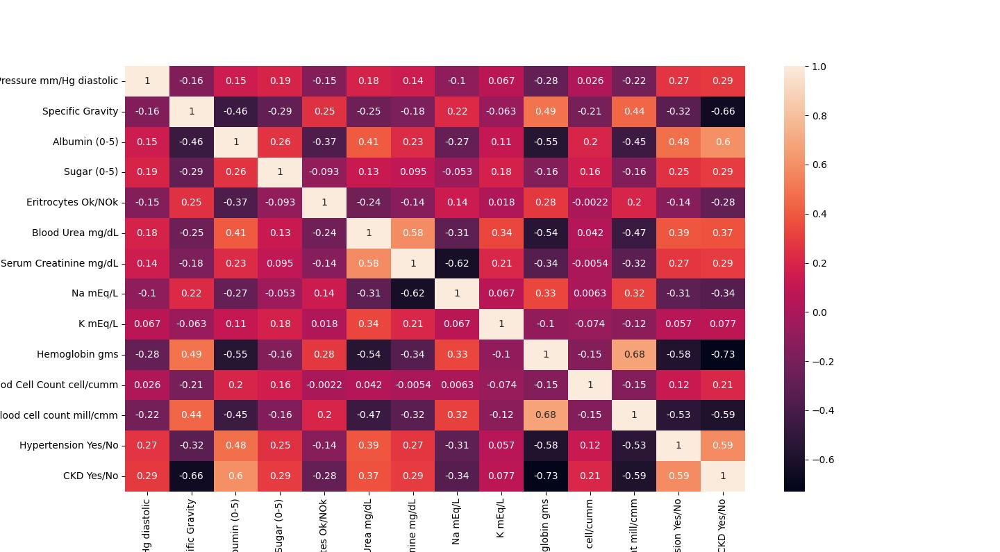
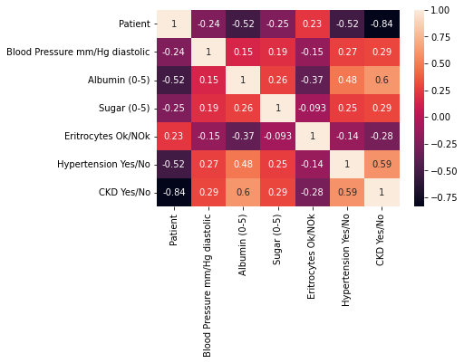
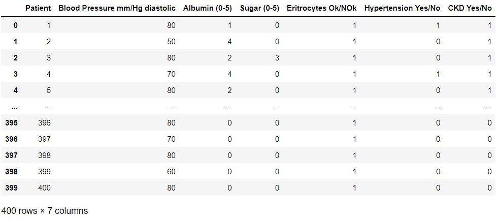
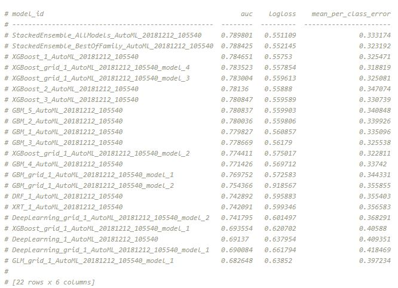

# UreSens: a diagnosis tool to monitor and predict Chronic Kidney Disease with a single urinalysis

Chronic kidney disease is a progressive condition that affects >10% of the general population worldwide, amounting to >800 million individuals. Chronic kidney disease is more prevalent in older individuals, women, racial minorities, and in people experiencing diabetes mellitus and hypertension. 

The disease represents an especially large burden in low- and middle-income countries, which are least equipped to deal with its consequences. Chronic kidney disease has emerged as one of the leading causes of mortality worldwide, and it is one of a small number of non-communicable diseases that have shown an increase in associated deaths over the past 2 decades. The high number of affected individuals and the significant adverse impact of chronic kidney disease should prompt enhanced efforts for better prevention and treatment.


The diagnosis of CKD is made by laboratory testing, most often by estimating glomerular filtration rate (GFR) from a filtration marker, such as serum creatinine or cystatin C, using various formulas, or by testing urine for the presence of albumin or protein (or a combination of these)(**Kidney Int Suppl. 2013; 3: 1-150**)

Most studies have used estimated GFR (eGFR) to determine the presence of CKD (and, therefore, report on the prevalence of CKD stages 3–5), whereas other studies have combined albuminuria (typically defined as an albumin-to-creatinine ratio of >30 mg/g) and decreased eGFR to report on CKD stages 1–5. Finally, to differentiate CKD (which is considered to be a chronic progressive disease) from conditions such as acute kidney injury or from transient fluctuations in kidney function unrelated to kidney damage, the standard definition of CKD includes a so-called “chronicity criterion” (i.e., that the low eGFR or elevated urine albumin should be detectable for at least 90 days, requiring the presence of repeated measurements over time). 

**There is currently no consensus on the length of time used in the assessment of CKD when applying the chronicity criterion, with epidemiologic studies applying various algorithms, from single measurements to any repeated measurements past 90 days, or limiting the repeated measurement(s) to 90 to 365 days, and from requiring consecutive repeated markers of CKD to accepting CKD markers interspersed with markers not conforming to CKD criteria.**

# 1. Objective

Find, clean and train data from patients with Chronic Kidney Disease to monitor the biomarkers from urine and possibly predict and detect early stages of Chronic Kidney Disease with a single urinanalysis test.

# 2. Running the app

Download the full repo, install the environment.yml file and requirements.txt file. Then, in a terminal run the following command:

```
streamlit run Home.py
```

and a local version of the app should prompt in your web browser.

# 3. Data acquisition

The data was taken from the Machine Learning Repository: https://archive.ics.uci.edu/ml/datasets/Chronic_Kidney_Disease

A clean version of this dataset was also found on Kaggle: https://www.kaggle.com/datasets/abhia1999/chronic-kidney-disease. This is actually the dataset I took as reference.

This is how the data looked like:



The data contains 400 rows and 14 columns. Each column name is the abbreviation of one parameter:

- **Bp:** blood pressure (mm/Hg)
- **Sg:** specific gravity (adimensional)
- **Al:** albumin (level 0-5, adimensional)
- **Su:** glucose (level 0-5, adimensional)
- **Rbc:** red blood cells, 1=good level, 0=bad levels
- **Bu:** blood urea (mg/dL)
- **Sc:** serum creatinine (mg/dL)
- **Sod:** sodium (mEq/L)
- **Pot:** potassium (mEq/L)
- **Hemo:** hemoglobin (gms)
- **Wbcc:** white blood cells count (cells/cumm)
- **Rbcc:** red blood cells count (millions/cmm)
- **Htn:** 1=has hypertension; 0=doesn't have hypertension
- **Class:** 1=has CKD; 0=doesn't have CKD

# 4. Data cleaning

```
You can have a look at the cleaning step in /tools/1-Cleaning.py
```

The first step was to rename the columns in order to properly understand what is our data. This was made by appling the custom function rename_columns().

I also looked for NaNs and nulls, which were 0 in both cases.

In order to understand how variables correlate, it was convenient to calculate the adjusted Pearson correlation coefficent.



It was clear that there are positive-related variables and negative-related. For the purpose of this work, **only positive parameters and/or parameters that can be detected by a urine test were kept.**

Therefore, the final variables are:

- Blood pressure
- Albumin
- Glucose
- Erythrocytes (blood)
- Hypertension
- Class

A new column, "Patient", was added in order to be the Primary Key in the MySQL database. This columns was not taken in order to perform machine learning.



```
The result was exported in data/chronic_disease_db_clean.csv
```

This is how the data looked after cleaning:



# 5. Machine Learning: modelling the data

The model training was executed with H2O Auto ML

 <p style="text-align:center;"></p>

 H2O is an open source, in-memory, distributed, fast, and scalable machine learning and predictive analytics platform that allows to build machine learning models on big data.

H2O AutoML is designed to have as few parameters as possible so that all the user needs to do is point to their dataset, identify the response column and optionally specify a time constraint or limit on the number of total models trained.

## 5.1. Initialization
The steps to train the data were:

- Initialize H2O service
  ```python
  import h2o
    from h2o.automl import H2OAutoML
    h2o.init()
  ```
- Import the cleaned dataset as a H2O dataframe
  ```python
  h2o.import_file
  ```
- Drop the Patient column
  
- Factorizing the class columns: H2O needs to transform the binary columns into an ENUM class. This is made by applying a .asfactor and ovewritting the column type. The data isn't transformed anyhow, just the column type for internal purposes. This is step is really imporant, it changes the behavior of the model.
  ```python
  df["column"]=df["column"].asfactor()
  ```
- Identify the y_train and x_train columns:
  ```python
    y = "CKD Yes/No"
    x = df.columns
    x.remove(y)
    ```

## 5.2 Executing H2O

Running the modelling goes as follows:

```python
aml = H2OAutoML(max_models = 10, seed = 2, balance_classes = True)
aml.train(x = x, y = y, training_frame = df)
```
where: 

- **max_models** = the maximum number of models to build in an AutoML run, excluding the Stacked Ensemble models,

- **seed** =  a seed for reproducibility,

- **balance_classes** = oversample the minority classes to balance the class distribution,

- **x** = a list/vector of predictor column names or indexes,

- **y** = the name (or index) of the response column,

- **training_set** = the training set

Default parameters:

- **nfolds:** -1. Let AutoML choose if k-fold cross-validation or blending mode should be used. Blending mode will use part of training_frame (if no blending_frame is provided) to train Stacked Ensembles.

## 5.3 Leaderboard

The AutoML object includes a “leaderboard” of models that were trained in the process, including the 5-fold cross-validated model performance (by default).

The models are ranked by a default metric based on the problem type (the second column of the leaderboard). **In binary classification problems, that metric is AUC**, and in multiclass classification problems, the metric is mean per-class error. In regression problems, the default sort metric is RMSE.

```python
lb = aml.leaderboard
print(lb.head(rows=lb.nrows))
```

An example of a leaderboard:


## 5.4 The best model

The best model obtained was with **Gradient Boosting Machine**. The metrics were the following:

| AUC | Logloss | Aucpr | Mean per class error | RMSE | MSE |
| --- | --- | --- | --- | --- | --- |
| 0.963173 | 0.202759 | 0.98234 | 0.0626667 | 0.242937 | 0.00185088 | 0.0590182 |

- **AUC (Are under the ROC curve):** It’s a way of measuring the performance of a binary classifier by comparing the False Positive Rate (FPR x-axis) to the True Positive Rate (TPR y-axis). An AUC of 1 indicates a perfect classifier, while an AUC of .5 indicates a poor classifier, whose performance is no better than random guessing.

- **Logloss:** Logarithmic loss. Measures the performance of a classifier by comparing the class probability to actual value (1 or 0). Unlike AUC which looks at how well a model can classify a binary target, logloss evaluates how close a model’s predicted values (uncalibrated probability estimates) are to the actual target value. Logloss can be any value greater than or equal to 0, with 0 meaning that the model correctly assigns a probability of 0% or 100%.

- **AUCPR (Area under the Precision-Recall curve):** This model metric is used to evaluate how well a binary classification model is able to distinguish between precision recall pairs or points. The main difference between AUC and AUCPR is that AUC calculates the area under the ROC curve and AUCPR calculates the area under the Precision Recall curve. The Precision Recall curve does not care about True Negatives.
Evaluation metrics for regression models (rmse, mse, …) are also calculated for classification problems.

- **Mean per class error:** is the average of the errors of each class in your multi-class data set. This metric speaks toward misclassification of the data across the classes. The lower this metric, the better.

- **RMSE:** RMSE is the Root Mean Square Error. The RMSE will always be larger or equal to the MAE. The RMSE metric evaluates how well a model can predict a continuous value. The RMSE units are the same units as your data’s dependent variable/target (so if that’s dollars, this is in dollars), which is useful for understanding whether the size of the error is meaningful or not. The smaller the RMSE, the better the model’s performance.  RSME is sensitive to outliers. If your data does not have outliers, then examine the Mean Average Error (MAE), which is not as sensitive to outliers.

- **MSE:** MSE is the Mean Square Error and is a model quality metric.  Closer to zero is better.  The MSE metric measures the average of the squares of the errors or deviations. MSE takes the distances from the points to the regression line (these distances are the “errors”) and then squares them to remove any negative signs. MSE incorporates both the variance and the bias of the predictor. MSE gives more weight to larger differences in errors than MAE.

## 5.5 Model saving

The best model was stored in /models for later loading and prediction.

# 6. Streamlit configuration

The app was made using Streamlit. Streamlit turns data scripts into shareable web apps in minutes and it's free to use.


For more info visit https://streamlit.io/

The app is divided in 5 sections:

- **Home:** it's basically the landing page, the summary of what is UreSens


- **About:** it contains the story behind the creator of UreSens (myself), with a direct link to my LinkedIn profile (you should check it out!)


- **Chronic Kidney Disease:** it contains the basic epidemiology of CKD: symptoms, causes, treatment, tests... It's very interesting for anyone looking for information about this disease.


- **How to take a urine sample:** detailed instructions about how to take a urine test with urine strips. With videos for better understanding.


 
- **Submit your results:** A submission form to input the results of the urine test. It has been improved in order to be as easy as possible for the user. The user just has to input the name, date, blood pressure and if they are diagnosed with hypertension. Later, it only has to pick the corresponding colour in the corresponding pad. A submit button needs to be clicked in order to store the data.
All the data is stored in a **MySQL database** in the cloud hosted in FreeSQLDatabase.com

    It also contains technical information about the test pads and limitations about the technique.


- **Your medical records:** In this section the user can monitor the analyzed urine biomarkers. The information previously stored in the database is now read and plotted in an interactive chart. The user can select which parameter they want to check. It also provides information about the safe or unsafe concentration levels of that biomarker.
  The second part of the page contains the jewel in the crown: the GBM model takes the average of the 5 main parameters and predicts whether that person might have an early stage of CKD or not. If it does, it pops up a message suggesting the user to visit the doctor for furher analysis.
  In order to prevent data leaking of medical results, this section is password protected, but a video is provided to show how it works:


## 6.1 Deployment

The app has been deployed using STREAMLIT. It can be accessible through the following URL:

**https://uresens.streamlit.app**

or by scanning this QR:


# 7. Future improvements

- The logged user currently can see the results of every user that took the test. The idea is that the plot shown and the ML result corresponds to the current username,

- A definitive hosting for the MySQL databse,
  
- Code arrengement, cleaning to provide faster results

- Ask more hospitals to gather more information and be able to predict this disease with all the biomarkers from urine, not only a few. Besides, I also need to validate the result whit real people with this disease.

# 8. Links and Resources

- Infographics: https://www.kisupplements.org/article/S2157-1716(21)00066-6/fulltext
  
- Scientific paper about CKD modelling: https://www.hindawi.com/journals/cmmm/2021/6141470/

- H2O AutoML docs: https://docs.h2o.ai/h2o/latest-stable/h2o-docs/automl.html
  
- H2O tutorial: https://github.com/h2oai/h2o-tutorials/blob/master/h2o-world-2017/automl/Python/automl_binary_classification_product_backorders.ipynb

- Metrics information: https://www.mle.hamburg/_repos/dat_sci/11_ml_perf_meas/
  
- MySQL Connector docs: https://dev.mysql.com/doc/connector-python/en/connector-python-example-cursor-select.html

- Streamlit docs: https://docs.streamlit.io/

